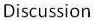

CRNN
=
Introduction
-
CRNN is the abstraction of Convolutional Recurrent Neural Network. It is basically a CNN followed by a RNN. The CNN is actually doing the encoding work, and the RNN is actually doing the decoding work. CRNN can be used to do text recognition. In this process, CRNN takes an image as input and outputs texts contained in the image.

The paper where CRNN comes from is [An End-to-End Trainable Neural Network for Image-based Sequence Recognition and Its Application to Scene Text Recognition](https://arxiv.org/abs/1507.05717). The original code of this paper is [bgshih/crnn](https://github.com/bgshih/crnn). The codes in this repository are basically built on [meijieru/crnn.pytorch](https://github.com/meijieru/crnn.pytorch).

Dependency
-
* PyTorch 1.3.0
* lmdb 0.98
* Pillow 6.2.1
* a GPU

Demo
-
A demo program can be found in ``demo.py``. 

A trained model is provided in [Baidu Netdisk](https://pan.baidu.com/s/1SSMzbu0Q-OJjS2zL1y1OPg). You should download it first and put it in ``trained_model/``.

Then launch the demo by:

    python demo.py

Example image:

Expected output:

    load input image...
    load trained model...
    predicted label: developer

Result
-
More results are listed below.

Image:

Output:

    load input image...
    load trained model...
    predicted label: discussion

Image:

Output:

    load input image...
    load trained model...
    predicted label: reception

The model is trained on the dataset of Robust Reading Competition's [Born-Digital Images (Web and Email)](http://rrc.cvc.uab.es/?ch=1&com=tasks) Challenge Task 1.3. The model can achieve around **70%** accuracy on the validationset.

Train a new model
-
1. Construct a new dataset using [``create_dataset.py``](https://github.com/bgshih/crnn/blob/master/tool/create_dataset.py).
2. 
    Execute:

        python train.py --trainset_path PATH_TO_TRAINSET --validationset_path PATH_TO_VALIDATIONSET
    
    The model will be saved every epoch. The model will be saved into directory ``model/``.